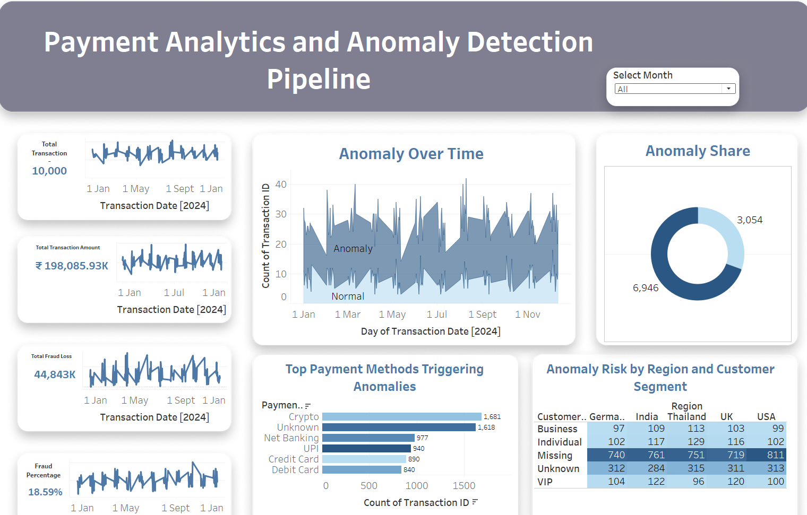

# Payment Analytics and Anomaly Detection Pipeline
##  Business Requirement  

The Goal of this project is to identify High Risk Customers and Suspicious Transactions also by reducing the time taken for mannual Anonmaly checks. 
To build a visual, insight-driven dashboard that helps stakeholders understand where anomalies occur and what triggers them.

---
##  Dataset Overview  
- **Type:** Synthetic transactional dataset  
- **Records:** 10,000 rows  
- **Time Frame:** Jan 2024 – Dec 2024  
- **Format:** CSV  
- **Sample Columns:**  
  - `Transaction_ID`, `Transaction_Amount`, `Customer_Type`,  
  - `Payment_Method`, `Region`, `Transaction_Date`,  
  - `Is_Anomaly`, `Is_Fraud`

The data mimics real-world fraud scenarios in digital transactions with labeled anomalies and frauds for simulation-based learning and insight generation.

---

## ⚙️ Tools & Techniques Used  
- **Tableau** – Interactive visual analytics  
- **Python (Pandas) – Data preprocessing, anomaly tagging  
- **Feature Engineering**  
  - Flagged `High_Amount` transactions  
  - Identified `Suspicious_Payment_Methods`  
  - Tagged `Unknown_Customer_Types` and `Risky_Regions`  
- **Manual Rule-Based Anomaly Detection**  
  - Based on business domain rules and realistic behavior anomalies

---

## Project Scope: What We Did  
- Cleaned and structured raw data using Python  
- Created new logical flags for potential fraud indicators  
- Calculated anomaly ratios and fraud loss amounts  
- Developed stakeholder-friendly dashboards using Tableau  
- Highlighted key patterns by time, region, method, and customer group

--

##  Outcome & Benefits

- Enables fast and visual fraud investigation  
- Identifies red-flag patterns based on data, not guesswork  
- Helps reduce financial leakage by flagging early indicators  
- Empowers business teams to make data-driven decisions

---

## Dashboard Preview
[View Tableau Dashboard](https://public.tableau.com/app/profile/lekhana.s1303/viz/PaymentAnalyticsandAnomalyDetectionPipeline/Dashboard1)

---

